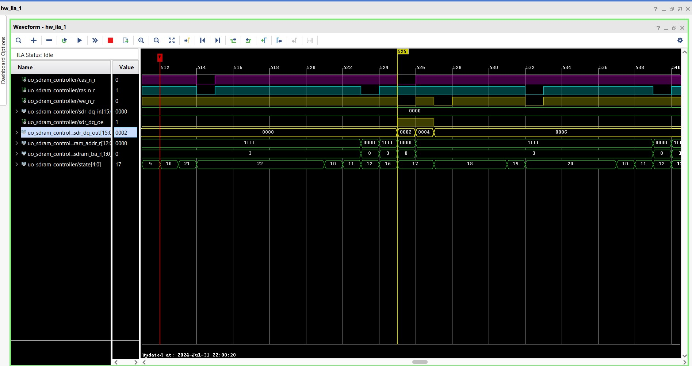

## SDRAM Controller

> This Repository Contains a SDRAM Controller Verilog HDL Code for Interfacing SDRAM(Readin from and Writing to)
  mounted on `ARTIX-A7 FPGA Board`

## FSM Controller For SDRAM

## Implementation Details

  - Single Mode Acess
  
    - This section describes the timing for `reading` and `writing` from/to single array location in `SDRAM`

    - **Single Write Access**

    - **Single Read Access**

  - Burst Mode access

    - This section describes the timing for `reading` and `writing` from/to multiple array location in `SDRAM` using `burst mode`

      - **BURST - 2 Write and read Access**
   

       `Write burst - 2` 

      

     
      `Read burst - 2`

      
   
    
     - **BURST - 4 Write and read Access**

     - **BURST - 8 Write and read Access**

     - **BURST -2 Read Access**

    - **BURST -4 Read Access**

    - **BURST -8 Read Access**

  - Full page access