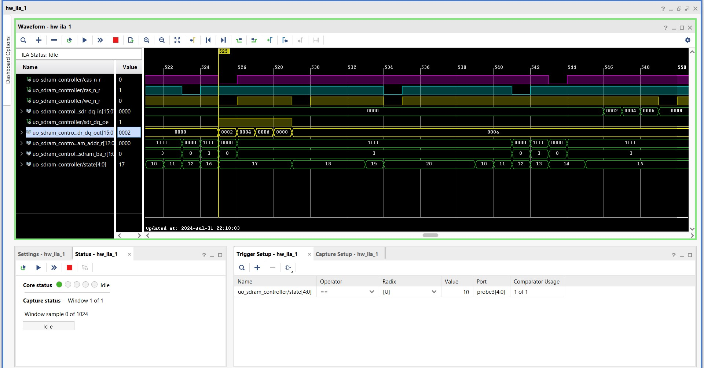
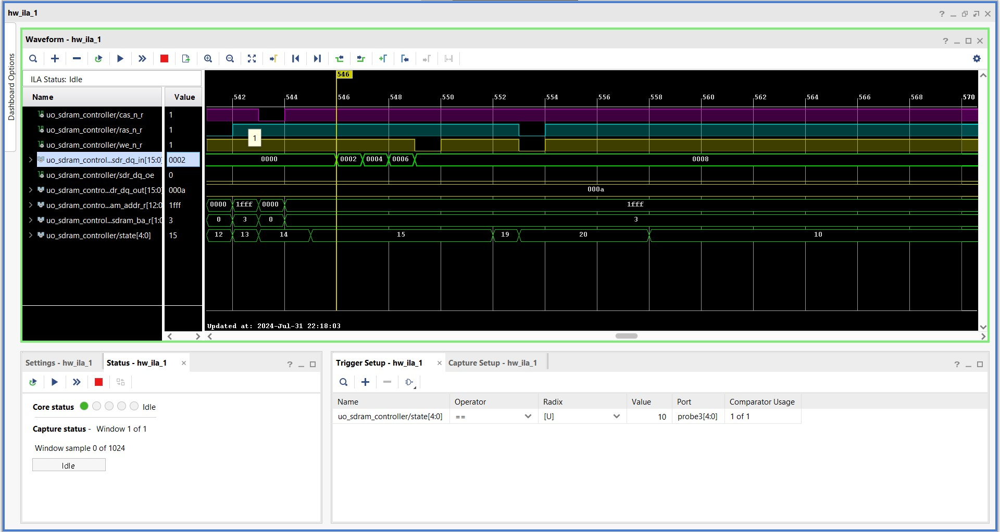

## SDRAM Controller

> This Repository Contains a SDRAM Controller Verilog HDL Code for Interfacing SDRAM(Reading from and Writing to `SDRAM`)
  mounted on `ARTIX-A7 FPGA Board`

## FSM Controller For SDRAM

## Implementation Details

  - Single Mode Acess
  
    - This section describes the timing for `reading` and `writing` from/to single array location in `SDRAM`

    - **Single Write Access**

    - **Single Read Access**

  - Burst Mode access

    - This section describes the timing for `reading` and `writing` from/to multiple array location in `SDRAM` using `burst mode`

       **NOTE**

       `Write burst on sdr_dq_out` 
       
       `Read burst on sdr_dq_in`
      
      - **BURST of 2 data (Write and read Access)**

       `Write burst`

       
     
      `Read burst`

      
   
    
     - **BURST of 4 data (Write and read Access)**
 
       `Write burst`

       
     
       `Read burst`

       

     - **BURST of 8 data (Write and read Access)**

  - Full page access