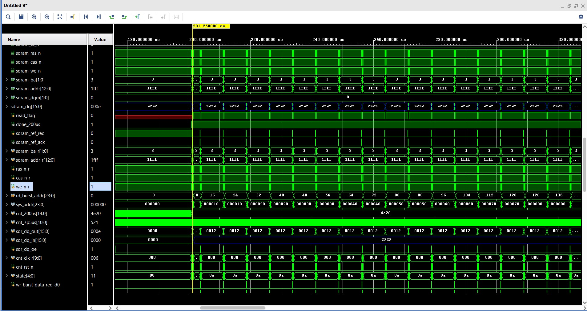
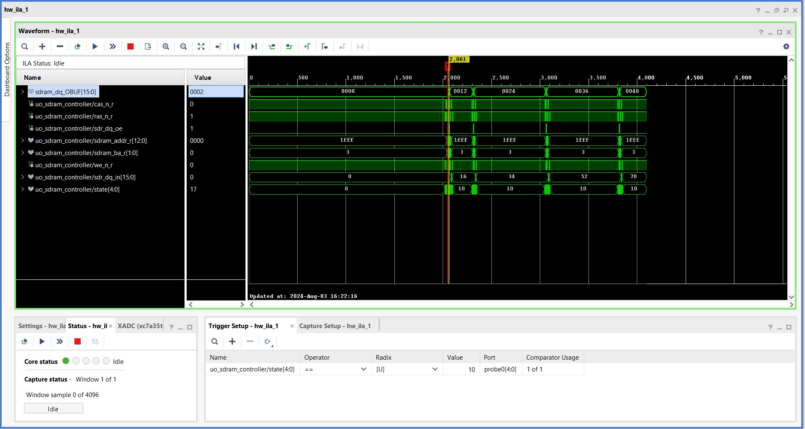
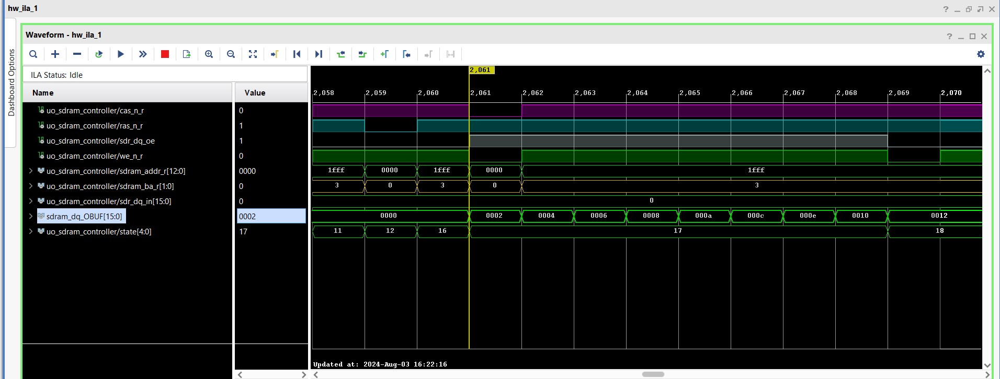
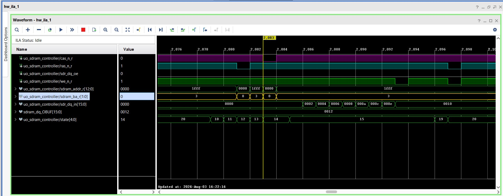
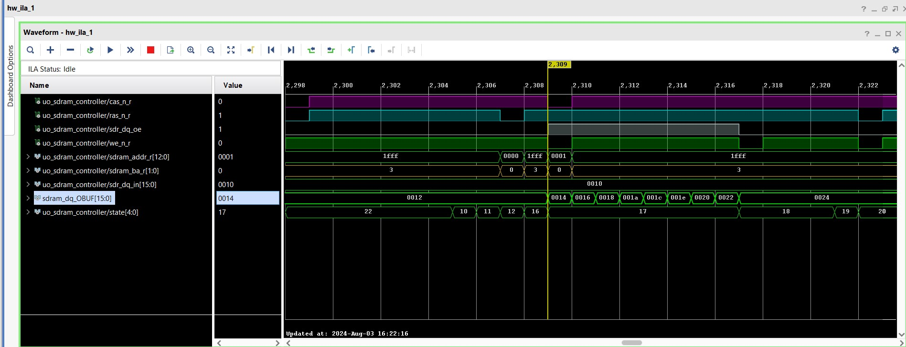
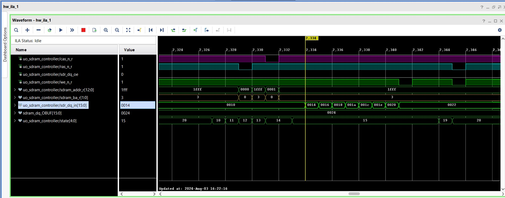

## SDRAM Controller

> This Repository Contains a SDRAM Controller Verilog HDL Code for Interfacing SDRAM(Reading from and Writing to `SDRAM`)
  mounted on `ARTIX-A7 FPGA Board`

## FSM Controller For SDRAM

## Simulation Details

   - `Burst - 8 - on incrementing column addresses`

    

   - `IN ILA` - `Burst - 8 - on incrementing column addresses`
  
   
   
  
  `Remember` -: Read data is converted into decimal as could be seen on `sdr_dq_in`

   `Address` [8:3] truncates to select the 4th[3] bit from `1000` , as you can see in the second transaction(second burst)
    the address got `1` and so on it changes to `2` , `3` ... in consecutive transactions. 

    `Note` - that `1fff` means every bit is high in address , that is considered like `don't care` when after 

    providing the `starting address` through `column address` for burst mode.

    `for more info` -: check the data sheet in top `README file`

`Let's take a Closer look at continuous read from different locations by writing the different data pattern`
  

  **First - burst of 8 bit - data being written**

  

  **First - burst of 8 bit - data being read**

  

  **Second - burst of 8 bit - data being written**

  

  **Second - burst of 8 bit - data being read**

  
   
 
 
  **Helpful note** 
     
     - `VIO` could be added by user to directly change the following parameters for 
                     accessing the different burst types -: 

     - `parameter BL` 
     
     - `parameter wr_burst_len` 
     
     - `parameter rd_burst_len` 

 - `Leaving the above exercise to fellow learners`  

## Implementation Details

  - Below are the implemented design outputs -: `FPGA` to `SDRAM` & `SDRAM to FPGA` in `ILA` -: 

  - Single Mode Acess
  
    - This section describes the timing for `reading` and `writing` from/to single array location in `SDRAM`

    - **Single Write Access**

    - **Single Read Access**

  
       

 

  - Full page access