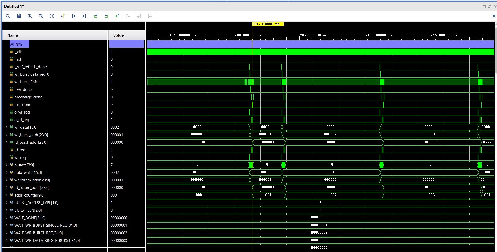
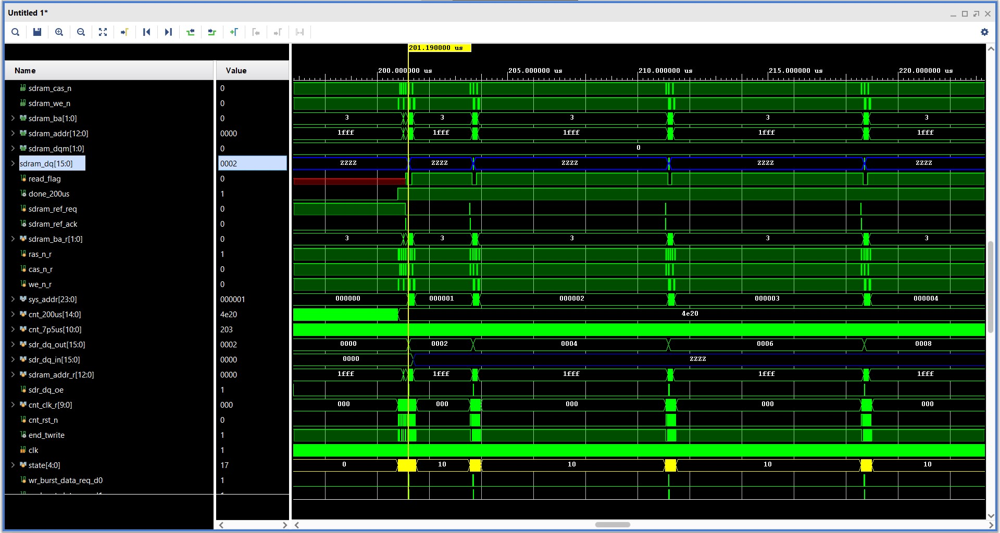
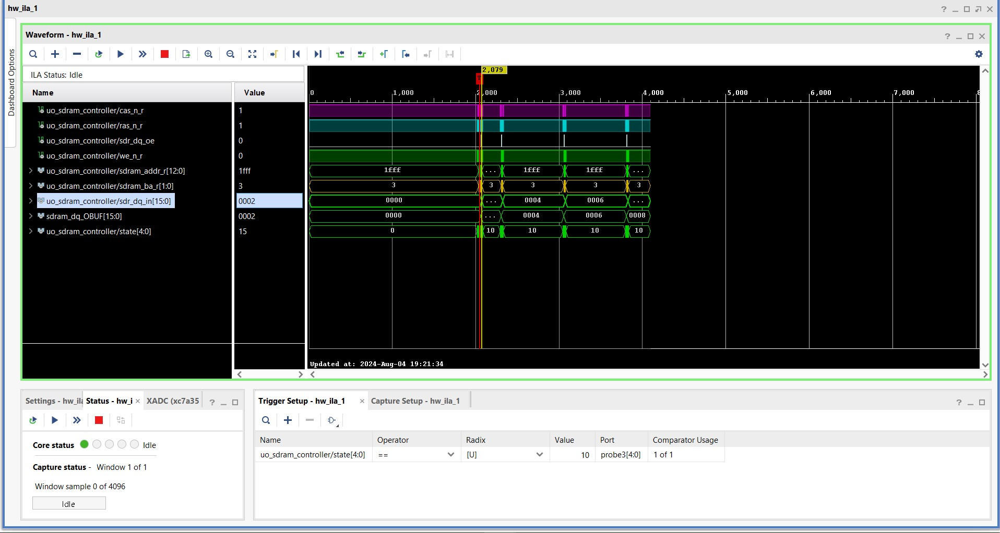
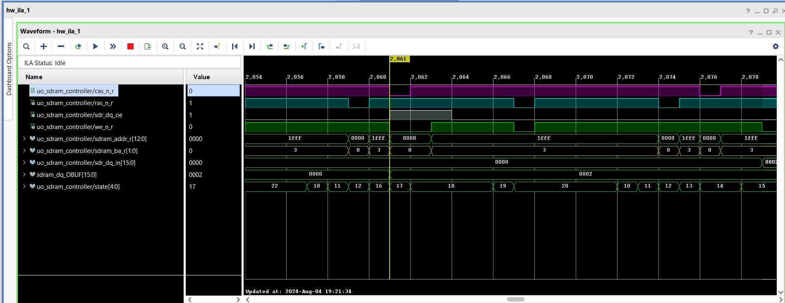
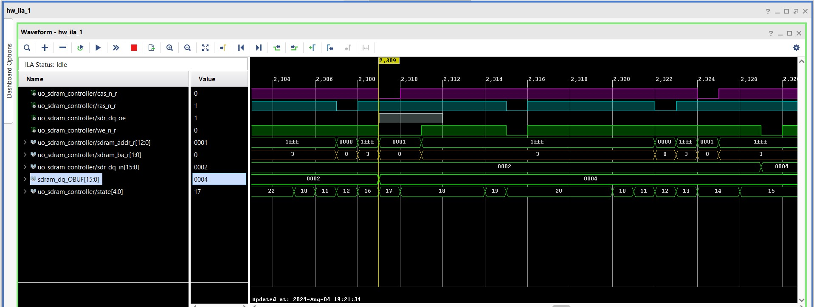
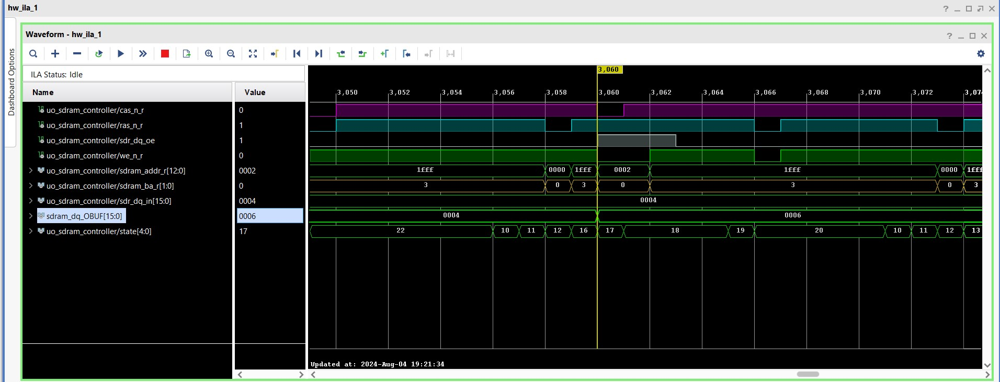
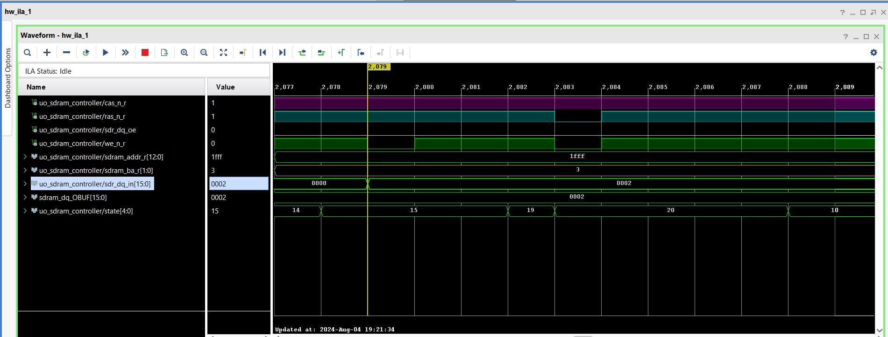
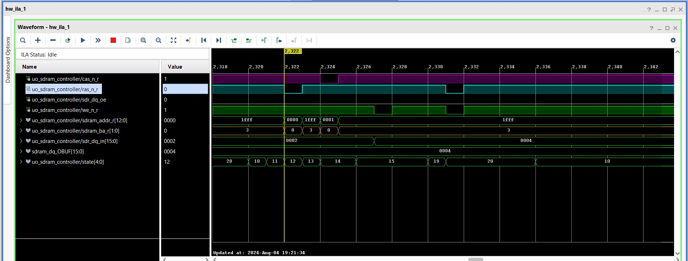
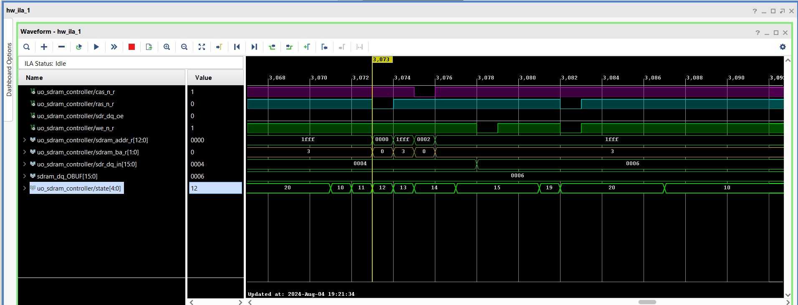

## SDRAM Controller

> This Repository Contains a SDRAM Controller Verilog HDL Code for Interfacing SDRAM(Reading from and Writing to `SDRAM`)
  mounted on `ARTIX-A7 FPGA Board`

## FSM Controller For SDRAM

## Simulation Details

   - `Burst - 8 - on incrementing column addresses`

    

## Implementation Details  - Burst Mode - 8 

   - `IN ILA` - `Burst - 8 - on incrementing column addresses`
  
   
   
  

  - `Sdram_Address_r` [8:3] truncates to select the 4th[3] bit from `1000` in sdram controller logic , as you can see in 
  
    the second transaction(second burst) the address got `1` and so on it changes to `2` , `3` ... in consecutive 
  
    transactions. 

 - `Note` - that `1fff` in sdram_addr means every bit is high in address , that is considered like `don't care` when after 

   providing the `starting address` through `column address` for burst mode .

 - `for more info` -: check the data sheet in top `README file`

 - `Remember` -: In the **following** transaction through `ILA` , `sdr_dq_in` and `sdram_dq_obuf` are internal to
      
      `sdram controller` as , the sdram data is bidirectional , so `in` and `out` transactions are shown

      separately.
 
- `Let's take a Closer look at continuous read from different locations by writing the different data pattern`
  

  **First - burst of 8 bit - data being written through sdram_dq_OBUF**

  

  **First - burst of 8 bit - data being read on sdr_dq_in**

  

  **Second - burst of 8 bit - data being written through sdram_dq_OBUF**

  

  **Second - burst of 8 bit - data being read on sdr_dq_in**

  
   
 
 
  **Helpful note** 
     
     - `VIO` could be added by user to directly change the following parameters for 
                     accessing the different burst types -: 

     - `parameter BL` 
     
     - `parameter wr_burst_len` 
     
     - `parameter rd_burst_len` 

     - `parameter BURST_OR_SINGLE_ACCESS_A9 = 1'b0' - should be 0 for burst mode

     - `parameter BURST_ACCESS_TYPE = 2'b00` - should be 2'b00 for burst mode

 - `Leaving the above exercise for burst 2 & 4 for fellow learners`  

## Implementation Details - Single Mode access - burst - 1 

  - Below are the implemented design outputs -: `FPGA` to `SDRAM` & `SDRAM to FPGA` in `ILA` -: 

  - Single Mode Access

    **Simulation view**

    - `Wr_rd_data_fsm sim`

     

    - `sdram_controller sim for single access`

       

    - This section describes the timing for `reading` and `writing` from/to single array location in `SDRAM`

  
    - `ILA view of reading and writing from/to sdram`

    

    - **Single Write Access**

    - **First address**

     

    - **Second address**

      

    - **Third address**

      
 

    - **Single Read Access**

    - **First address**

     

    - **Second address**

      

    - **Third address**

      
 

  
       

 

  - Full page access