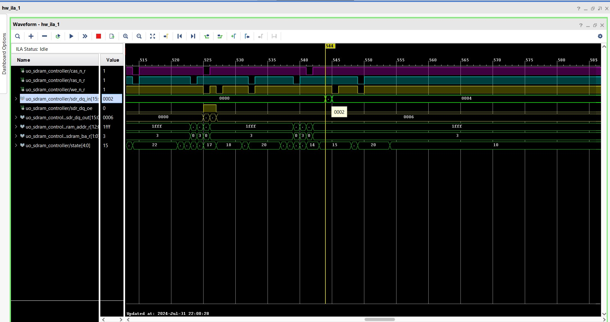

## SDRAM Controller

> This Repository Contains a SDRAM Controller Verilog HDL Code for Interfacing SDRAM(Reading from and Writing to `SDRAM`)
  mounted on `ARTIX-A7 FPGA Board`

## FSM Controller For SDRAM

## Simulation Details

   - `Burst - 8 - on incrementing column addresses`

    

   - `IN ILA` - `Burst - 8 - on incrementing column addresses`

  

  `Closer look at continuous read from different locations by writing the same data pattern`
  
  `Remember` -: Read data is converted into decimal as could be seen on `sdr_dq_in`

  **Check the time stamp - 2086**

  

  **Check the time stamp - 2334 , same data read from different location**

  

 
  **Helpful note** 
     
     - `VIO` could be added by user to directly change the following parameters for 
                     accessing the different burst types -: 

     - `parameter BL` 
     
     - `parameter wr_burst_len` 
     
     - `parameter rd_burst_len` 

 - `Leaving the above exercise to fellow learners`  

## Implementation Details

  - Below are the implemented design outputs -: `FPGA` to `SDRAM` & `SDRAM to FPGA` in `ILA` -: 

  - Single Mode Acess
  
    - This section describes the timing for `reading` and `writing` from/to single array location in `SDRAM`

    - **Single Write Access**

    - **Single Read Access**

  - Burst Mode access

    - This section describes the timing for `reading` and `writing` from/to multiple array location in `SDRAM` using `burst mode`

       **NOTE**

      - `Write burst`  is on `sdr_dq_out` 
       
      - `Read burst` is  on `sdr_dq_in`
      
    - **BURST of 2 data (Write and read Access)  - one burst**

       `Write burst`

       
     
      `Read burst`

      
   
    
     - **BURST of 4 data (Write and read Access)  - one burst**
 
       `Write burst`

       
     
       `Read burst`

       

     - **BURST of 8 data (Write and read Access)  - one burst**

       `Write burst`

       
     
       `Read burst`

       
   

       

 

  - Full page access